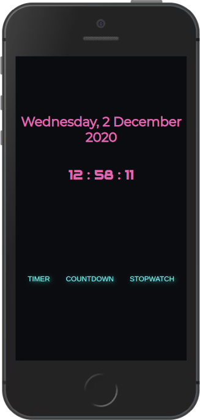

# Timer

## Description

Bootcamp exercise. I was asked to develop a mini application similar to a stopwatch or countdown.

This is my Clock App. It is a clock that runs on the browser and have the following services:

- Countdown clock: given a date in future it returns how many years, months, days, hours and minutes are left.

- Timer: the user can choose the minutes and clock starts counting down the time until reaches zero.

- Stopwatch: the user clicks on start and time starts counting. The user then can see how much has passed.

## Project Requirements

- Deliver the code in a repository
- An attractive ReadMe
- Must be deployed.

## Reflection

Altough I was asked just to develop one type of application, I decided to build a clock app with the 4 functionalities: Clock, Stopwatch, Timer, Countdown.
The project consisted in 3 fases:

- Fase One:

  - Planned the application with a very advanced tool: pen and paper. I did a very rough sketch of how I wanted the app to look like.
  - Wrote all the functionalities, except for the clock, with no UI, and debbuged using VScode console.
  - I decided to use the Date javascript object, as opposed to increments with one second intervals, to improve accuracy

- Fase Two

  - Integration the funcionality with the UI. I found some problems and had to refactor some of the functions
  - In terms of Styling, I started with bootstrap to get it up an running fast, and then switched to CSS because it was a requirement.

- Fase Three

  - Refactoring: tried to improve my code readability by renaming functions and variables, extracting into smaller functions, and isolating each service into its own file.
  <!-- write issues on GitHub Repo
      add sound to timer and countdown (feat)
      refactor: look for code repetions and see if can be refactored (refactor)
      add leading zeros to minutes and seconds when less than 10 (ui)
      add pause functionality to timer and countdown and stopwatch (feat)
      use local storage for the countdown time
  -->
  - Deploy on githubpages

With this exercise I have learnt:

- Javascript Date Object. When to use new Date() and when to use Date.now(), how to use these to manipulate time.
- SetInterval and clearInterval how to use it to simulate a clock functionality.
- Try to apply some of the clean code principles that I have been learning.

## Screen Shots, Demo

## Built with

- Frontend: HTML, CSS and vanilla JavaScript.

## Getting Started

No instalation required

## Run Tests

No test were implemented
